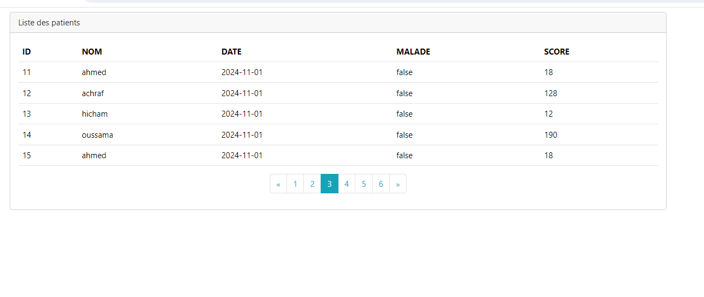
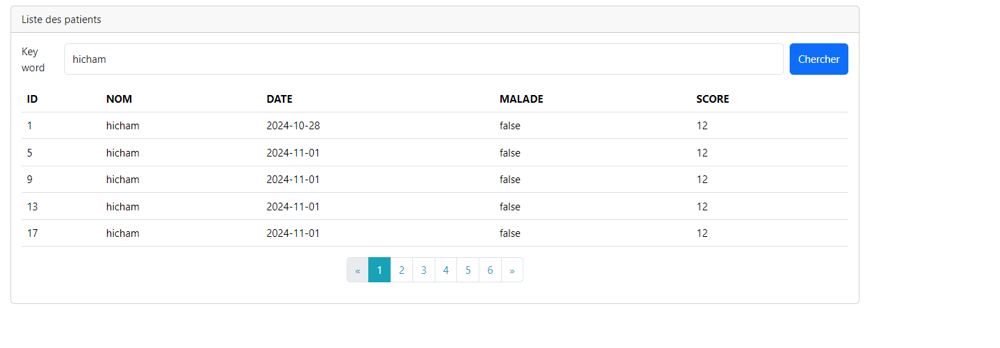
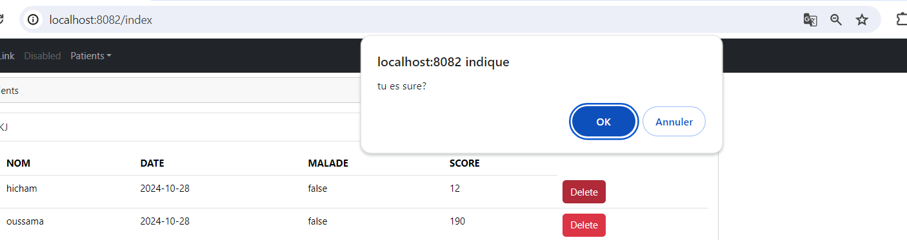
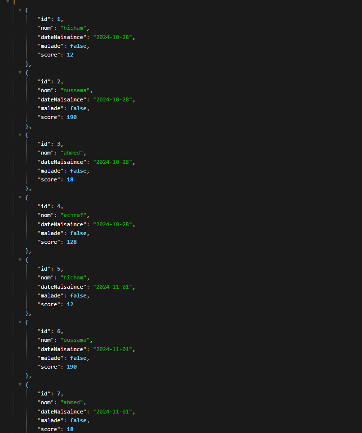
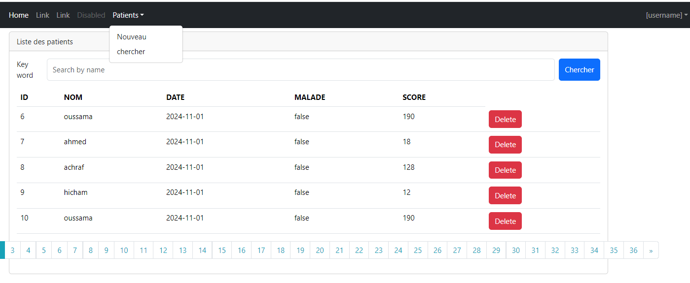
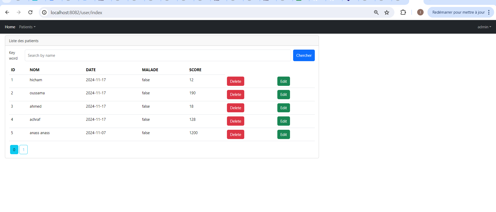
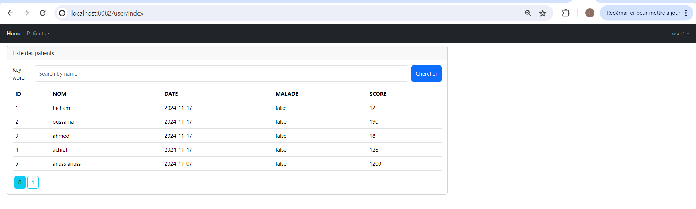

<h1>Afficher les patients et Faire la pagination</h1>

<h1>chercher des patients</h1>

<h1>Supprimer un patient</h1>

<h1>affichge de donnés</h1>

<h1>Création de la page template</h1>

<h1>Validation des formulaires</h1>

<h1>Validation des formulaires rélutat  </h1>

<h1>auth admin</h1>

<h1>auth user</h1>

<h1>login user1</h1>

<h1>table app user</h1>

<h1>table authorities </h1>
*
<h1>table app user roles</h1>

